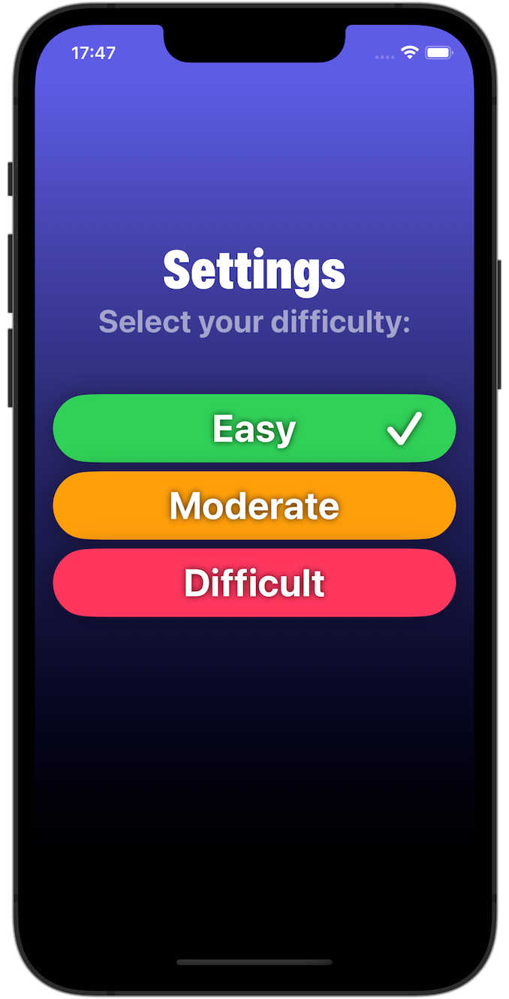

# Flash Math

A simple SwiftUI app that allows children to practice their math skills.

Initial version was implemented along the [HWS+](https://www.hackingwithswift.com/plus/) live stream by Paul Hudson.
Further enhancements have been made by myself.

## Key Features

- Three difficulty levels (Easy, Moderate and Difficult) to adjust the allowed time limit for responding to a question
- Diverse question types to challenge different math skills:
  - "How many multiples of A are in B?"
  - "Which number is a multiple of C?"
  - "Which is the highest/lowest number?"
  - "What is the result of X + Y?" using the five operations:
    - Addition (+): Sum or Plus
    - Subtraction (-): Difference or Minus
    - Multiplication (×): Product or Times
    - Division (÷): Quotient
    - Exponentiation (²): Squared

## Screenshots

 

  

  

## System Requirements

The app needs Xcode 15 to build and iOS 17 to run.
